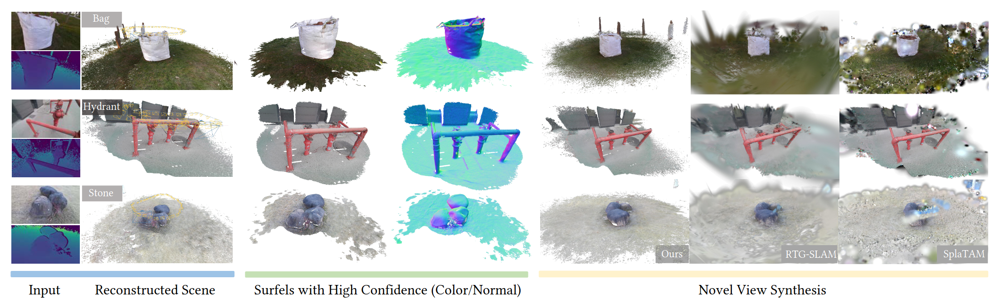

# EGG-Fusion: Efficient 3D Reconstruction with Geometry-aware Gaussian Surfel on the Fly

<p align="center">
    <a href="https://arxiv.org/abs/2512.01296" target="_blank">
        
    </a>
    <a href="https://zju3dv.github.io/eggfusion/" target="_blank">
        
    </a>
    <a href="LICENSE" target="_blank">
        
    </a>
</p>


This repository contains the implementation of following paper:

> [**EGG-Fusion: Efficient 3D Reconstruction with Geometry-aware Gaussian Surfel on the Fly**](https://arxiv.org/abs/xxxx.xxxxx)<br>
> ***SIGGRAPH ASIA 2025***, HongKong<br>
> [Xiaokun Pan](https://github.com/panxkun)<sup>1</sup>, Zhenzhe Li<sup>1</sup>, [Zhichao Ye](https://github.com/oneLOH)<sup>2</sup>, [Hongjia Zhai](https://zhaihongjia.github.io/)<sup>1</sup>, [Guofeng Zhang](http://www.cad.zju.edu.cn/home/gfzhang/)<sup>1</sup> <br>
> **<sup>1</sup> State Key Lab of CAD&CG, Zhejiang University <sup>2</sup>SenseTime Research** <br>
> (Corresponding authors: Guofeng Zhang and Zhichao Ye)<br>



## Overview
<p align="center">
    
</p>

EGG-Fusion is a real-time 3D reconstruction system leverages geometry-aware Gaussian surfels for real-time dense mapping and tracking. 
Currently, the repository only contains the code for core system, and it will be gradually updated and improved in the near future: 

- [x] Code of System Implementation
- [ ] Realtime Visualzation 
- [ ] Evaluation Scripts
- [ ] Online Mode for RGB-D Sensor

## Installation

**Prerequisites**

We have tested the code on:
- Ubuntu 20.04
- Python 3.9
- PyTorch 2.5.1+cu121

**Clone Repository**

```bash
git clone --recursive https://github.com/panxkun/eggfusion.git
```

**Install Dependencies**

```bash
conda create -n eggfusion python=3.9
conda activate eggfusion
pip install torch torchvision torchaudio --index-url https://download.pytorch.org/whl/cu121
pip install -r requirements.txt
```

**Build Submodules**

* Build cuda extension for dense tracking 
```
cd src/utils/cuda
pip install --no-build-isolation .
```
* Build cuda extension for diff-gaussian-surfel
```
cd submodules/diff-gaussian-surfels
pip install --no-build-isolation .
```

* Build ORB-SLAM2 dependencies
```
./submodules/orb-slam-deps/build_orb.sh
```
please refer to this [link]() for more details if you occured 

## Datasets

**Directory Structure**

Place your datasets in the `datasets/` folder:
<details>
<summary>Show dataset directory structure</summary>

```
datasets/
├── replica/
├── tum/
├── scannetpp/
    ├── 39f36da05b
    ├── 8b5caf3398
    ├── f34d532901
    └── 8b5caf3398
```

</details>


In this data structure, `replica/` and `tum/` contains the same scenes as used in [SplaTAM](https://github.com/spla-tam/SplaTAM).

**Supported Datasets**

1. **Replica**: High-quality synthetic RGB-D sequences. Download from [Replica](https://github.com/facebookresearch/Replica-Dataset)
2. **TUM RGB-D**: Real-world RGB-D benchmark sequences. Download from [TUM](https://vision.in.tum.de/data/datasets/rgbd-dataset)
3. **ScanNet++**: Large-scale indoor RGB-D dataset. Download from [ScanNet](https://kaldir.vc.in.tum.de/scannetpp/)

## Quick Start

### Basic Usage

```bash
# Run on Replica dataset as an example
python main.py --config configs/replica/office0.yaml
```

### Online Mode

Currently, we test this mode on the Azure Kinect dataset. Please refer to [Azure Kinect](https://github.com/microsoft/Azure-Kinect-Sensor-SDK) documentation for setup. If you want to configure other RGB-D cameras, you can setup the camera driver and override the `RGBDDataset` class in the dataloader. 

> **Note**: This part of the code is not yet fully organized. We recommend using the Azure Kinect for online mode as it provides high-quality depth data and is well-supported.


## Acknowledgments
This project is built upon several open-source projects and libraries. We thank the authors for their contributions:
- [Guassian-Surfel](https://github.com/turandai/gaussian_surfels)
- [RTG-SLAM](https://github.com/MisEty/RTG-SLAM)
- [ElasticFusion](https://github.com/mp3guy/ElasticFusion)
- [ORB-SLAM2](https://github.com/raulmur/ORB_SLAM2)

## License

EGG-Fusion is licensed under the Apache License - see the [LICENSE](LICENSE) file for details.

## Citation

If you found this code/work to be useful in your own research, please considering citing the following:
```bibtex
@inproceedings{pan2025egg,
  title={EGG-Fusion: Efficient 3D Reconstruction with Geometry-aware Gaussian Surfel on the Fly},
  author={Pan, Xiaokun and Li, Zhenzhe and Ye, Zhichao and Zhai, Hongjia and Zhang, Guofeng},
  booktitle={Proceedings of the SIGGRAPH Asia 2025 Conference Papers},
  pages={1--12},
  year={2025}
}
``